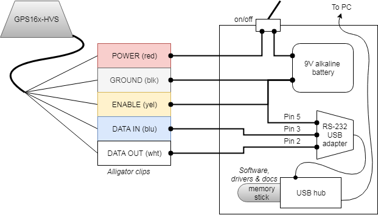
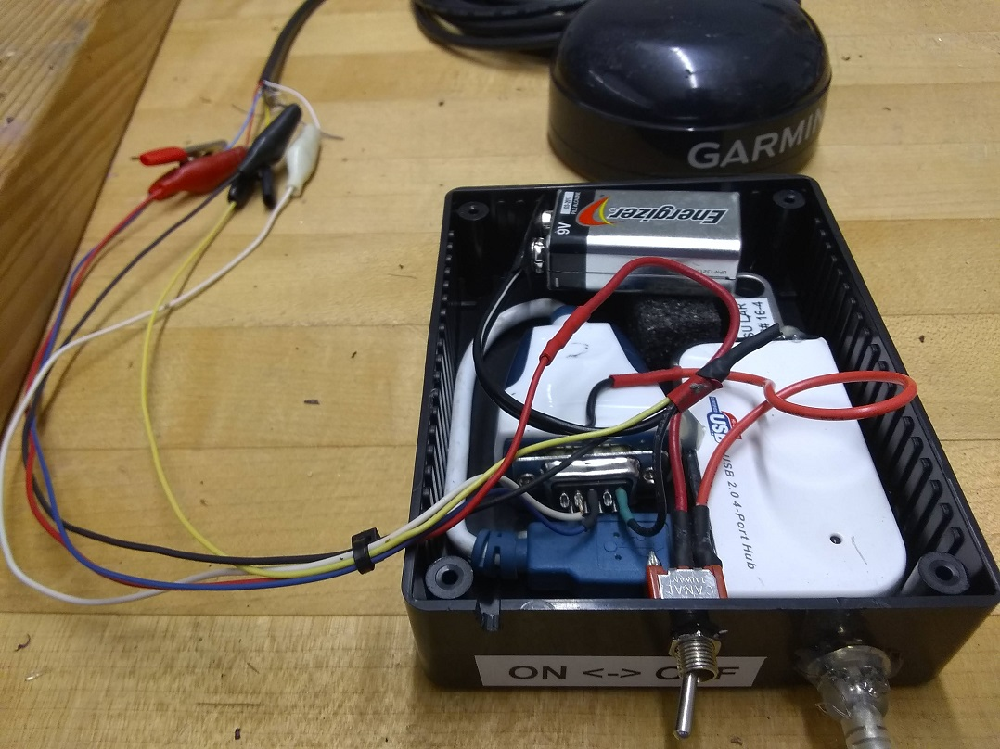

# Garmin GPS16X-HVS Programming Adapter

DIY field programming adapter for the [Garmin GPS16X-HVS](https://buy.garmin.com/en-US/US/p/13194)
GPS receiver. Use this with a portable computer running Windows&#8482; to upload new firmware.

## Assembly

## Usage

> *Required software is loaded onto a USB drive inside the programmer, but is
> not present in this repository. See References below for download links.*

1. Turn the GPS unit **off**
2. Connect alligator clips to GPS data wires:
    * Blue - data in
    * White - data out
2. Connect alligator clips to GPS power wires (or leave connected to existing
   power supply):
    * Yellow - enable
    * Red - power in
    * Black - power ground
3. Turn the GPS unit **on**:
    * For built-in 9V supply, turn switch OFF &rarr; ON.
    * For existing power supply, use established procedure
2. Setup the computer:
    * Plug USB cable into computer
    * Install the usb-serial adapter driver, as necessary: `CDM21228_Setup.zip`
    * Install the new firmware package: `GPS16x_420.exe`
3. Right-click `SNSRXCFG_330.exe` and choose **Launch as Administrator** (the
   updater program will silently fail if not launched with admin rights), then
   connect to the GPS:
    * Choose **GPS 16x** when prompted
    * Setup the serial port under *Comm* &rarr; *Setup*:
        * Serial Port: *look up correct port under Computer > Manage > Device
          Manager > Ports (COM & LPT)*
        * Baud: leave as *Auto* or manually specify *38400*
    * Connect to the GPS using *Comm* &rarr; *Connect*
4. Initiate the firmware upgrade using *Config* &rarr; *Update Software (F12)*
    * Follow the instructions provided by the prompts
    * Select the region file provided with the firmware package
    * Select the updater program provided with the firmware package
    * Wait
    * Once the upgrade completes, restart the sensor config program
      > *Failure to restart the sensor config program may result in inability to
      > connect to the GPS unit.*
5. Connect using the sensor config tool and verify settings match intended values.

## References

* Campbell Scientific. *GPS16X-HVS GPS Receiver Instruction Manual.* Rev Oct 2017.
  Retrieved [2019-04-05](http://web.archive.org/web/20190406023559/https://s.campbellsci.com/documents/us/manuals/gps16x-hvs.pdf).
  Online: <https://s.campbellsci.com/documents/us/manuals/gps16x-hvs.pdf>.

* Future Technology Devices International Ltd. *D2XX Direct Driver Setup Executable.* 
  Version 2.12.28. Retrieved [2019-04-05](http://web.archive.org/web/20190406023750/https://www.ftdichip.com/Drivers/CDM/CDM21228_Setup.zip).
  Online: <https://www.ftdichip.com/Drivers/D2XX.htm>

* Garmin International. *GPS 16x Technical Specifications.* Rev October 2011.
  Retrieved [2019-04-05](http://web.archive.org/web/20190405200736/http://static.garmin.com/pumac/GPS_16x_tech_specs.pdf).
  Online: <http://static.garmin.com/pumac/GPS_16x_tech_specs.pdf>.

* Garmin International. *GPS 16x software version 4.20.* Retrieved
  [2019-04-05](http://web.archive.org/web/20190406024209/http://download.garmin.com/software/GPS16x_420.exe).
  Online: <https://www8.garmin.com/support/download_details.jsp?id=4061>.

* Garmin International. *SNSRXCFG software version 3.30.* Retrieved
  [2019-04-05](http://web.archive.org/web/20190406024309/http://download.garmin.com/software/SNSRXCFG_330.exe).
  Online: <https://www8.garmin.com/support/download_details.jsp?id=4053>.
